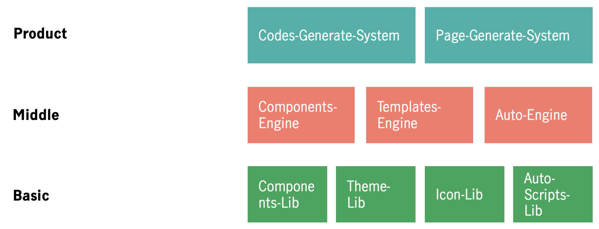

# SledDog
unity components &amp; templates &amp; auto-layout-generation

# Construct

# Basic

## Components-Lib ( Bones )

Vue Component Files

Components Review Borad

## Theme—Lib ( Skins )

Base Style Files

Theme Style Files

## Icon-Lib ( Chain )

Icon Svg Files

Icon Fonts Files

## Auto-Scripts-Lib ( Hair )

Gulp Auto-Testing Scripts

Webpack Auto-Packaging Scripts

Gulp Auto-Deploy—Server Scripts

Shell Auto-Deploy-RunTasks Scripts

# Middle

## Components-Engine ( Luggage )

Convert Component File to Objactification Model Data

Mapping Component with Model

## Templates-Engine ( Sled )

Convert Template Page to Page Layout Model Data

Mapping Template with Model

## Auto-Engine ( Wheel )

Control Auto-Script Work-Flow

Edit Auto-Scripts Content

# Product

## Codes-Generate-System ( WhiteSledDog )

Generate Target Frame(Vue/React/Angular/Mini-gram) Codes

Generate Target Frame(Vue/React/Angular/Mini-gram) Project

## Pages-Generate-System ( BlackSledDog )

Generate Page

Control Pages in one Project

Deploy Currently Project
